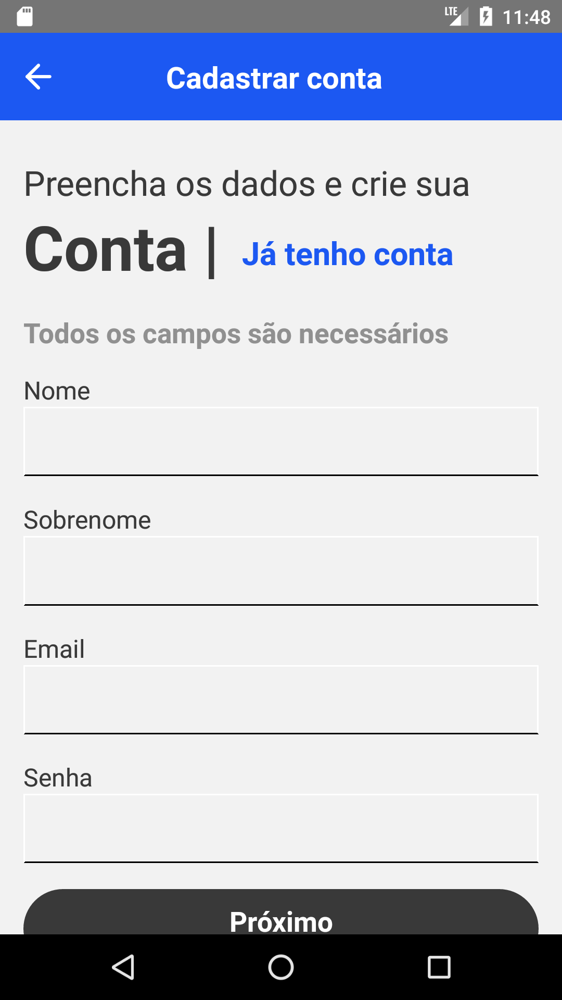
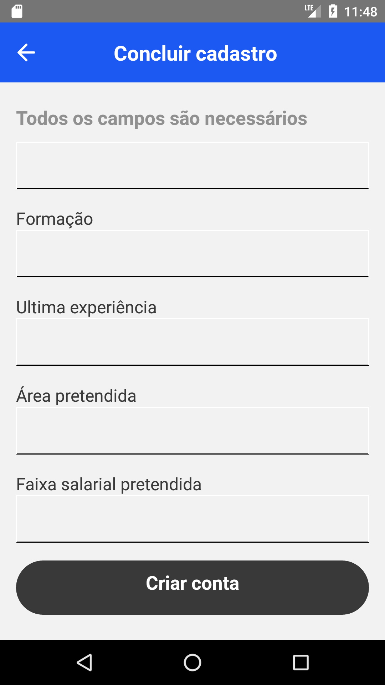

# AppEmpregos-ReactNative
 
Aplicativo mobile para anúncios de vagas de emprego, onde o usuário pode se cadastrar, vizulizar vagas, favoritar e se candidatar as vagas. Api criada para o projeto: <a href="https://github.com/cesar99144/EmpregosCodeIgniter" target="_blank">Api catálogo empregos</a>. 

    
    
    
    
    

