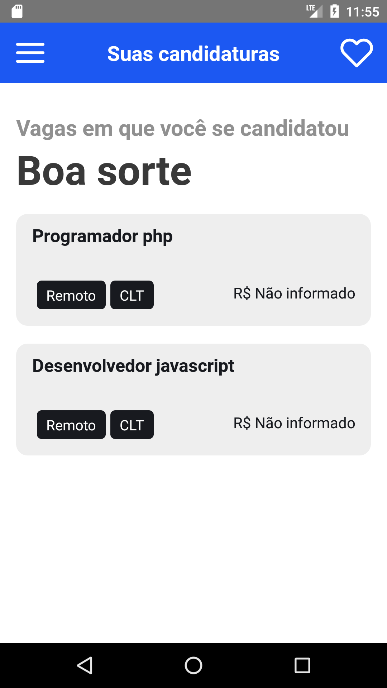

# AppEmpregos-ReactNative
 
Aplicativo mobile para anúncios de vagas de emprego, onde o usuário pode se cadastrar, vizulizar vagas, favoritar e se candidatar as vagas. Api criada para o projeto: <a href="https://github.com/cesar99144/EmpregosCodeIgniter" target="_blank">Api catálogo empregos</a>. 

    
    
    
    
    

    
    
    
    
    
    

<h3>Foi utilizado no projeto:</h3>
<ul>
    <li>React native</li>
    <li>Axios para as requisições HTTP</li>  
</ul>

<h3>Requisitos instalação:</h3>
    <blockquote>
       <ul>
        <li>React native instalado</li>
        <li>Npm do node para caso precise rodar algum pacote</li>
       </ul>
        
       Api do projeto <a href="https://github.com/cesar99144/EmpregosCodeIgniter" target="_blank">Api empregos</a>
    </blockquote>
    <blockquote>
       No projeto acessei a api no emulador utilizando o endereço ip local e a porta da api, por exemplo: <code>http://192.168.1.6:8081</code> Para conseguir executar seria necessário ajustar esses valores de acordo com seu ambiente de desenvolvimento.
    </blockquote>